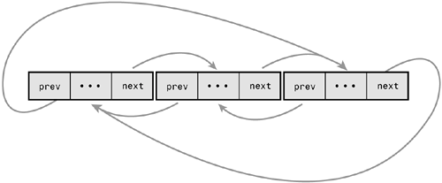

implementation is based on **linux kernel list (include/linux/list.h)**

Capabilities:
* traverse – iterate through list returning its nodes;
* clean – makes a list empty;
* tailadd – appends one element to the end of the list;
* insert node at index – put node at exact position in the list;
* remove – removes node from list by index;
* reverse – reverse the order of items in the list;
* bubble sort - sorting list via bubble sort algorithm
 

You may run the sample:

## Execute:
* make all
* ./sample_use

### Clean
- make clean

